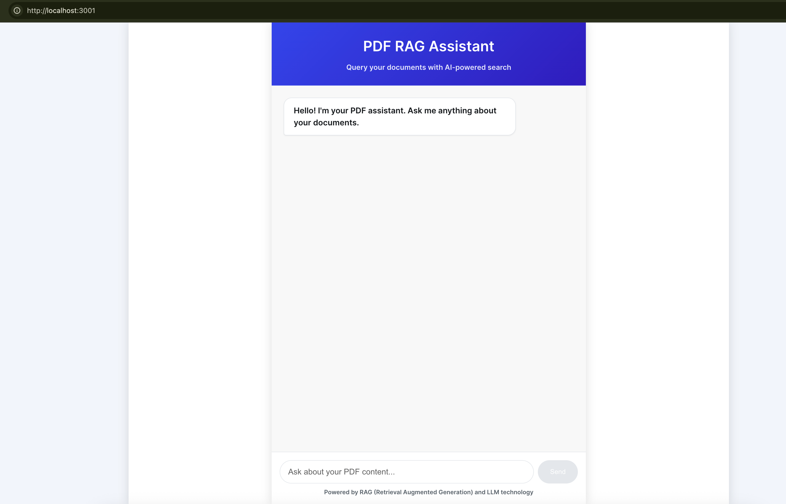

# RAG Chat Frontend

This is the **frontend interface** for the RAG (Retrieval-Augmented Generation) Chat application. It provides a conversational UI that connects to a Node.js + MongoDB backend powered by PDF embeddings and Gemini (Google Generative AI).

---

## Features
 
- Ask questions based on uploaded PDF documents
- Uses vector embeddings for semantic search
- AI answers generated via Gemini
- Highlights contextual responses
- Built with React and Node Js REST APIs

---

## UI Preview



---

## Getting Started

### Prerequisites

- Node.js (v18+)
- npm or yarn
- Backend RAG API (see [rag-01 backend](https://github.com/Mathi27/AskDocs.AI)) running at `http://localhost:PORT_NO`

### Install dependencies

```bash
npm install
# or
yarn install
